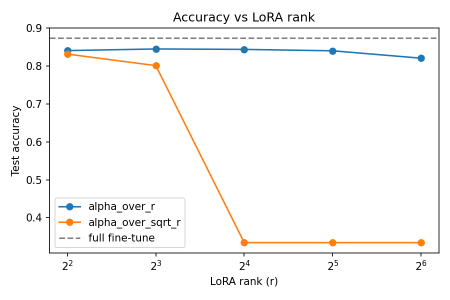
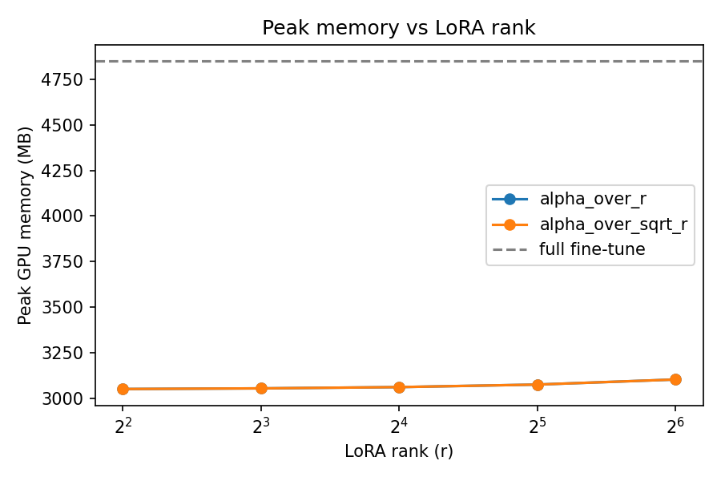

# LoRA From Scratch: Biomedical Sentence Classification

A from-scratch PyTorch implementation of LoRA (Low-Rank Adaptation), used
to fine-tune a pretrained transformer on the PubMed-RCT sentence
classification task, benchmarked directly against full fine-tuning of the
same model. Examines memory size, speed, and accuracy of LoRA vs full-finetuning
to gain a better understanding of Parameter-efficient Fine-tuning (PEFT)

## Task & data

[PubMed-RCT](https://huggingface.co/datasets/armanc/pubmed-rct20k):
classify each sentence of a biomedical abstract as `BACKGROUND`,
`OBJECTIVE`, `METHODS`, `RESULTS`, or `CONCLUSIONS` — oftentimes a real structuring
task for unstructured medical literature (177k train / 29.7k validation /
29.6k test sentences).

**Model:** `roberta-base` (125M params), fine-tuned two ways:
1. **Full fine-tuning** — every parameter trainable (baseline)
2. **LoRA** — base frozen, low-rank adapters (`lora_A`, `lora_B`) injected
   into the `query`/`value` attention projections of every layer

## Project structure

| File | Purpose |
|---|---|
| `lora_layers.py` | `LoRALinear` (the adapter itself) + `inject_lora` (recursively incorporates it into a real model) |
| `data.py` | Loads and tokenizes PubMed-RCT into PyTorch `DataLoader`s |
| `model.py` | Builds the full fine-tune model and the LoRA-injected model |
| `metrics.py` | Measurements across all models : trainable param count, GPU memory, wall-clock time, checkpoint size, accuracy/macro-F1 |
| `train.py` | One training loop used by both experiment types |
| `run_experiments.py` | Orchestrates the baseline run + the rank/scaling ablation sweep, writes `results.csv` |
| `plots.py` | Accuracy-vs-rank and memory-vs-rank charts from `results.csv` |
| `accuracy_vs_rank.png` | Accuracy vs. rank graph |
| `memory_vs_rank.png` | Memory vs. rank graph |
| `results.csv`| Raw results from `run_experiments.py`|

## The ablation

Sweeps LoRA rank `r ∈ {4, 8, 16, 32, 64}` against two adapter-scaling
conventions:
- `alpha/r` — the original LoRA paper's convention
- `alpha/√r` — proposed by follow-up work ("rank-stabilized LoRA") as a
  more precise way to hold the adapter's output magnitude constant across
  ranks

## Key implementation details worth knowing

- **Asymmetric initialization.** Similar to the original paper, `lora_A` is Kaiming-initialized,
  `lora_B` is zero-initialized. Zero-initializing both gives zero gradient
  for *both* matrices
- **Only `query`/`value` are adapted**, matching the original LoRA paper's
  finding that this captures most of the benefit at a fraction of the
  parameter cost of adapting every linear layer (try to keep trainable params as low as possible)

## Running it

```bash
pip install -r requirements.txt
python run_experiments.py   # needs a GPU + internet access for model/dataset download
python plots.py
```

Built and tuned for a single free-tier Colab T4 GPU.

## Results

| Method | Rank | Alpha mode | Accuracy | Macro F1 | Wall-clock (s) | Peak memory (MB) | Checkpoint size (MB) | Trainable % |
|---|---|---|---|---|---|---|---|---|
| Full fine-tune | N/A | N/A | 0.873656 | 0.813971 | 3416.720476 | 4847.559082 | 475.523969 | 100% |
| LoRA | 4 | alpha/r | 0.840997 | 0.776421 | 289.662616 | 3052.625488 | 2.848199 | 0.594480% |
| LoRA | 4 | alpha/√r | 0.831733 | 0.767166 | 293.937116 | 3052.625488 | 2.848536 | 0.594480% |
| LoRA | 8 | alpha/r | 0.845290 | 0.782875 | 293.425635 | 3056.094238 | 3.410699 | 0.711796% |
| LoRA | 8 | alpha/√r | 0.801339 | 0.725736 | 293.144853 | 3056.094238 | 3.411036 | 0.711796% |
| LoRA | 16 | alpha/r | 0.844141 | 0.781192 | 293.773506 | 3063.031738 | 4.535754 | 0.945599% |
| LoRA | 16 | alpha/√r | 0.334167 | 0.100188 | 292.506206 | 3063.031738 | 4.536092 | 0.945599% |
| LoRA | 32 | alpha/r | 0.840456 | 0.775482 | 294.582571 | 3076.906738 | 6.785754 | 1.409916% |
| LoRA | 32 | alpha/√r | 0.334167 | 0.100188 | 292.788633 | 3076.906738 | 6.786092 | 1.409916% |
| LoRA | 64 | alpha/r | 0.820948 | 0.752138 | 295.847692 | 3104.656738 | 11.285754 | 2.325613% |
| LoRA | 64 | alpha/√r | 0.334167 | 0.100188 | 294.613256 | 3104.656738 | 11.286092 | 2.325613% |




*Note: the full fine-tune baseline trained on the complete 177k-row training set for 3 epochs; the LoRA runs trained on a 25k-row subsample for 1-2 epochs, for practicality on a single Colab T4 session. Wall-clock and memory figures are each internally comparable within their own row group, but the accuracy gap between LoRA and full fine-tuning is likely somewhat narrower than shown here, since LoRA saw substantially less data.*

## Conclusions

Interesting results were seen. Full-finetuning of the Roberta model showed a baseline accuracy of approximately 87.3%. 
LoRA recovers most of full fine-tuning's accuracy at a small fraction of the cost. With the standard alpha/r scaling, every rank tested landed ~3-5 points behind the full fine-tune's 87.37% accuracy (82.09-84.53% across the five ranks), while training only 0.59-2.33% of the model's parameters. However, we can see real practical implications: a 2.8-11.3 MB adapter versus a 475.5 MB full checkpoint (40-170x smaller), and roughly 35% less peak GPU memory. This solidifies the idea of giving up some accuracy for a fraction of the memory size.

We can also see that a higher rank does not necessarily perform better. Among alpha/r runs, r=8 was the best-performing configuration (84.53%), narrowly ahead of r=4 and r=16, with r=64 trailing behind at 82.09% — the worst of the five. More trainable parameters didn't lead to more accuracy here; it likely just gave the adapter more capacity to overfit a 25k-row subsample in one epoch. Further confirmation (with regards to this experimentation setup) would reqire testing with more data and epochs. 

The alpha/√r results reveal an interesting result. I chose alpha = 2 * r and thus for alpha/r we maintain a constant scaling factor of 2 regardless of rank. This changes for the alpha/√r runs. Applied to alpha/√r instead, this alpha is now not a constant scaling factor, but effectively scales with rank: alpha = 4.0 at r=4, up to 16.0 at r=64. Combined with LoRA's learning rate, that growing scaling term amplifies gradients enough to likely destabilize training — and past some threshold between r=8 and r=16, all three higher-rank runs collapsed identically to predicting one constant class (we can see how accuracy and macro-F1 matches up to six decimal places, for these alpha/√r runs to six, across three independently trained models). Thus, further testing would likely look to examine a rank-independent alpha for alpha/√r runs

In conclusion, I look at this experiment as more of an exploratory and initial playing around with LoRA and PEFT, given constrained computing availability. It helped me understand the underlying theory and architectures, but also exemplified several nuances in training and model performance with regards to model hyperparameters. Furthermore, it cemented the accuracy/efficiency trade-off for PEFT and LoRA and just how useful these ideas can be when scaled up to large (slight accuracy trade-off but much more efficient). 
